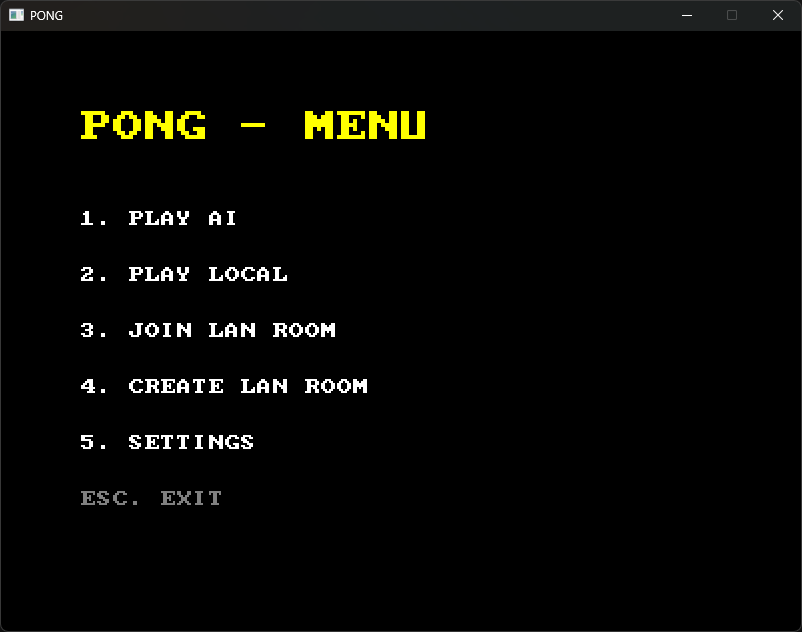
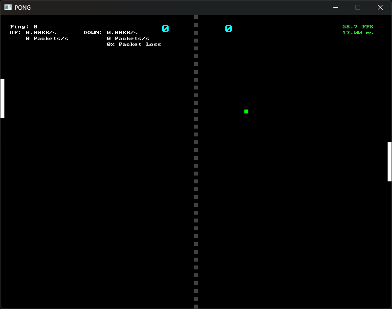

# 🏓 PongCpp

A simple multiplayer Pong game written in C++ as part of an internship learning project.

## Requirements

- C++20 compatible compiler
- [SDL3](https://github.com/libsdl-org/SDL)
- Windows SDK (for [WinSock](https://learn.microsoft.com/en-us/windows/win32/winsock/getting-started-with-winsock))

## Controls

- Player 1: `LeftShift` / `LeftCTRL`
- Player 2: Arrow `UP` / `DOWN`

## Screenshots

### Menu

### LAN

